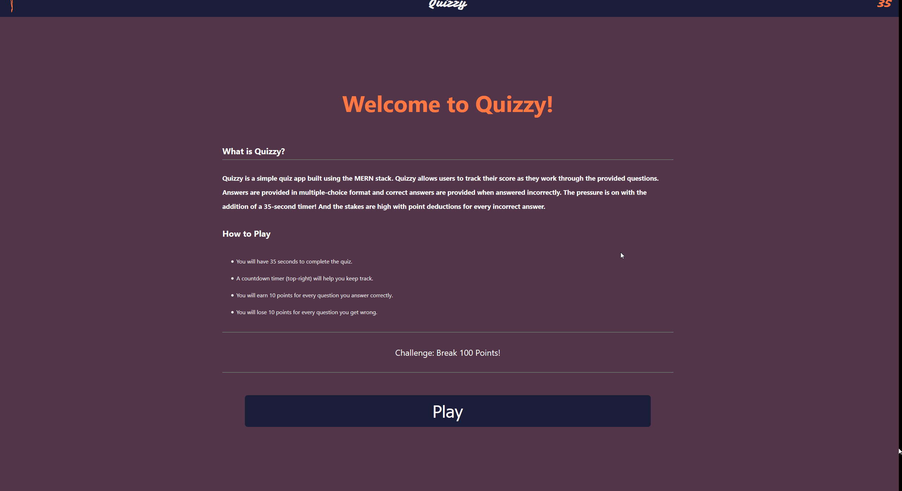

# Quizzy



## Table of Contents

<br>

- [Description](#description)
- [Technologies](#technologies)
- [Get Started](#get-started)
- [References](#references)
- [License](#License)
- [Author's Info](#author's-info)

<br>

## Description

<br>

Quizzy is a simple quiz app built using React.

Quizzy allows users to track their score as they work through the provided questions.

Answers are provided in multiple choice format and correct answers are provided when answered incorrectly.

The pressure is on with the addition of a 35-second timer!

And the stakes are high with point deductions for every incorrect answer!!

Can you break 100 and be "super-hero like"?

Try if you dare!

<br>

[Back To Top](#Quizzy)

<br>

## Technologies

<br>

- [M]ongoDb/Mongoose
- [E]xpress
- [R]eact
- [N]ode

<br>

[Back To Top](#Quizzy)

<br>

## Get Started

<br>

### Link to test the app hosted on GitHub Pages:

<br>

[Link: Quizzy on GitHub Pages](https://brokenhoax.github.io/Code_Challenge_Front/)

<br>

### To run the app locally:

<br>

<strong>Step 1</strong> - Clone the GitHub repository:

[Link: Quizzy Repository on GitHub](https://github.com/brokenhoax/Code_Challenge_Front)

```javascript
git clone https://github.com/brokenhoax/Code_Challenge_Front
```

<br>

<strong>Step 2</strong> - Install Quizzy's dependencies by running the following command within the root directory of your recently cloned folder:

```javascript
npm install
```

<br>

<strong>Step 3</strong> - After Step 2 has completed and the Node packages have been installed, run the following command within the root directory of your recently cloned folder:

```javascript
npm start
```

<br>

<strong>Step 4</strong> - After Step 3 your browser should launch Quizzy. If Quizzy didn't launch, and assuming your local host port is set to 3000, click [this link](http://localhost:3000/) to launch Quizzy.

<br>

<strong>Step 5</strong> - Enjoy!

<br>

[Back To Top](#Quizzy)

<br>

## References

<br>

[Built with React](https://reactjs.org/docs/getting-started.html)

[MERN JWT Authorization with Devistry](https://www.youtube.com/c/Devistry/featured)

[Styling Tips & Tricks with Kevin Powell](https://www.youtube.com/channel/UCJZv4d5rbIKd4QHMPkcABCw)

[State Crash Course with DevEd](https://www.youtube.com/c/DevEd/featured)

[Props and Context with WebDevSimplified](https://www.youtube.com/channel/UCFbNIlppjAuEX4znoulh0Cw)

[CSS Modules with CSS-Tricks](https://css-tricks.com/css-modules-part-3-react/)

<br>

[Back To Top](#Quizzy)

<br>

## License

<br>

Released under MIT License

Copyright (c) 2020 | Andrew Kraus

Permission is hereby granted, free of charge, to any person obtaining a copy of this software and associated documentation files (the "Software"), to deal in the Software without restriction, including without limitation the rights to use, copy, modify, merge, publish, distribute, sublicense, and/or sell copies of the Software, and to permit persons to whom the Software is furnished to do so, subject to the following conditions:

The above copyright notice and this permission notice shall be included in all copies or substantial portions of the Software.

THE SOFTWARE IS PROVIDED "AS IS", WITHOUT WARRANTY OF ANY KIND, EXPRESS OR IMPLIED, INCLUDING BUT NOT LIMITED TO THE WARRANTIES OF MERCHANTABILITY, FITNESS FOR A PARTICULAR PURPOSE AND NONINFRINGEMENT. IN NO EVENT SHALL THE AUTHORS OR COPYRIGHT HOLDERS BE LIABLE FOR ANY CLAIM, DAMAGES OR OTHER LIABILITY, WHETHER IN AN ACTION OF CONTRACT, TORT OR OTHERWISE, ARISING FROM, OUT OF OR IN CONNECTION WITH THE SOFTWARE OR THE USE OR OTHER DEALINGS IN THE SOFTWARE.

<br>

[Back To Top](#Quizzy)

<br>

## Author's Info

<br>

- GitHub - [brokenhoax](https://github.com/brokenhoax)
- LinkedIn - [Andrew Kraus](https://www.linkedin.com/in/andrewkraus/)

<br>

[Back To Top](#Quizzy)
